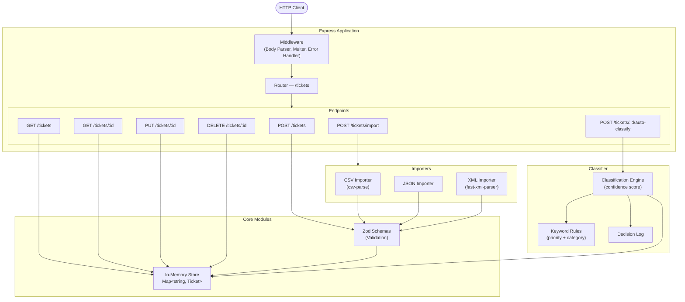

# 🎧 Homework 2: Intelligent Customer Support Ticket System

> **Student Name**: Valentyn Korniienko
> **Date Submitted**: 19.05.2026
> **AI Tools Used**: Claude Code

---

## ✨ Features

- **Multi-Format Import**: Parse and bulk-import tickets from CSV, JSON, and XML
- **Auto-Classification**: Intelligent ticket categorization and priority assignment using rule-based keywords
- **RESTful API**: Complete CRUD operations with advanced filtering
- **Type Safety**: Full TypeScript with Zod validation
- **Comprehensive Testing**: 72 tests with 93%+ branch coverage
- **Production Ready**: Error handling, validation, and performance optimized

---

## 🏗️ Architecture



---

## 📦 Tech Stack

- **Runtime**: Node.js 18+
- **Framework**: Express 4.x
- **Language**: TypeScript 5.x
- **Validation**: Zod
- **Testing**: Jest + Supertest
- **Parsing**: csv-parse, fast-xml-parser

---

## 🚀 Quick Start

### Installation

```bash
npm install
```

### Environment Setup

```bash
# Create .env (optional)
PORT=3000
```

### Start Development Server

```bash
npm run dev
```

Server runs on `http://localhost:3000`.

### Run Tests

```bash
# Run all tests
npm test

# Run with coverage report
npm run test:coverage
```

---

## 📁 Project Structure

```
homework-2/
├── README.md
├── TASKS.md
├── package.json
├── tsconfig.json
├── jest.config.ts
│
├── src/
│   ├── index.ts                 # Server entry point
│   ├── app.ts                   # Express app factory (testable)
│   ├── models/
│   │   └── ticket.schema.ts     # Zod schemas (source of truth)
│   ├── store/
│   │   └── ticketStore.ts       # In-memory CRUD + filtering
│   ├── importers/
│   │   ├── index.ts             # Format dispatcher
│   │   ├── csvImporter.ts       # CSV parsing
│   │   ├── jsonImporter.ts      # JSON parsing
│   │   └── xmlImporter.ts       # XML parsing
│   ├── classifier/
│   │   ├── rules.ts             # Keyword rules
│   │   ├── classifier.ts        # Classification logic
│   │   └── log.ts               # Decision logging
│   ├── routes/
│   │   └── tickets.ts           # API endpoints
│   ├── middleware/
│   │   ├── errorHandler.ts      # Global error handling
│   │   └── upload.ts            # Multer configuration
│   └── utils/
│       └── http.ts              # HttpError + asyncHandler
│
├── tests/
│   ├── fixtures/                # CSV / JSON / XML test data
│   ├── helpers.ts               # makeTicketInput() factory
│   └── test_*.test.ts           # 9 test suites (72 total tests)
│
├── demo/
│   ├── demo.sh                  # End-to-end demo script (bash + curl)
│   ├── sample_tickets.csv       # 10 sample tickets
│   ├── sample_tickets.json      # 5 sample tickets
│   └── sample_tickets.xml       # 5 sample tickets
│
└── docs/
    ├── api/
    │   └── API_REFERENCE.md     # All endpoints, schemas, cURL examples
    ├── architecture/
    │   └── ARCHITECTURE.md      # Diagrams, components, design decisions
    └── testing/
        └── TESTING_GUIDE.md     # Test pyramid, how to run, manual checklist
```

---

## 🧪 Test Coverage

**Overall: 93.52% branch coverage** (threshold: 85%)

```bash
npm run test:coverage
```

| Metric | Result | Threshold |
|---|---|---|
| Statements | 98.92% | 85% ✅ |
| Branches | 93.52% | 85% ✅ |
| Functions | 92.3% | 85% ✅ |
| Lines | 99.38% | 85% ✅ |

**Total: 72 passing tests across 9 suites**

---

## 🎬 Demo

Run a full end-to-end walkthrough of the API with a single command. Requires only `curl` — the script starts and stops the server automatically.

```bash
bash demo/demo.sh
```

The script covers 12 scenarios in sequence:

| Step | Scenario |
|---|---|
| 1 | Create a single ticket via JSON body |
| 2 | Fetch it by ID |
| 3 | Update — assign to agent, set `in_progress` |
| 4 | Auto-classify — prints category, priority, confidence, reasoning |
| 5 | List all tickets and filter by category / status |
| 6 | Resolve — `resolved_at` auto-populated |
| 7 | Bulk import from `demo/sample_tickets.csv` (10 rows) |
| 8 | Bulk import from `demo/sample_tickets.json` with `autoClassify=true` |
| 9 | Bulk import from `demo/sample_tickets.xml` (5 rows) |
| 10 | Validation error — invalid email → 400 with details |
| 11 | Unsupported import format → 400 |
| 12 | Delete ticket → confirm 404 |

**Sample data files:**

| File | Format | Rows | Notes |
|---|---|---|---|
| [`demo/sample_tickets.csv`](demo/sample_tickets.csv) | CSV | 10 | Mixed categories, priorities, metadata columns |
| [`demo/sample_tickets.json`](demo/sample_tickets.json) | JSON | 5 | Array shape, varied categories |
| [`demo/sample_tickets.xml`](demo/sample_tickets.xml) | XML | 5 | `<tag>` children, varied categories |

---

## 🔧 API Quick Reference

### Create Ticket
```bash
curl -X POST http://localhost:3000/tickets \
  -H "Content-Type: application/json" \
  -d '{
    "customer_id": "C-1",
    "customer_email": "user@example.com",
    "customer_name": "John",
    "subject": "Cannot login",
    "description": "I cannot access my account password reset.",
    "metadata": { "source": "web_form" }
  }'
```

### Bulk Import (CSV) with Auto-Classification
```bash
curl -X POST "http://localhost:3000/tickets/import?autoClassify=true" \
  -F "file=@demo/sample_tickets.csv"
```

### List Tickets with Filters
```bash
curl "http://localhost:3000/tickets?category=account_access&priority=urgent"
```

### Auto-Classify an Existing Ticket
```bash
curl -X POST http://localhost:3000/tickets/{id}/auto-classify
```

See [docs/api/API_REFERENCE.md](docs/api/API_REFERENCE.md) for the full endpoint reference.

---

## 📚 Documentation

| Document | Audience | Contents |
|---|---|---|
| [README.md](README.md) | Everyone | Setup, structure, demo, quick reference |
| [docs/api/API_REFERENCE.md](docs/api/API_REFERENCE.md) | API consumers | All 7 endpoints, schemas, enums, cURL examples, error formats |
| [docs/architecture/ARCHITECTURE.md](docs/architecture/ARCHITECTURE.md) | Tech leads | Mermaid diagrams, component descriptions, sequence diagrams, design decisions, security & performance |
| [docs/testing/TESTING_GUIDE.md](docs/testing/TESTING_GUIDE.md) | QA engineers | Test pyramid diagram, how to run, fixture locations, per-suite tables, manual checklist, benchmarks |

---

## 🤝 Contributing

1. Write tests first (TDD approach)
2. Ensure coverage remains ≥85%
3. Run `npm test` before committing
4. Type checking: `npm run typecheck`

---

<div align="center">

*This project was completed as part of the AI-Assisted Development course (Homework 2).*

</div>
