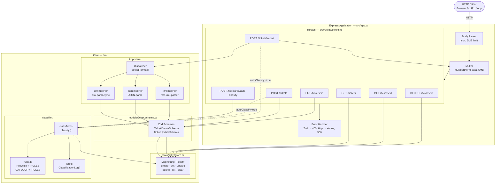
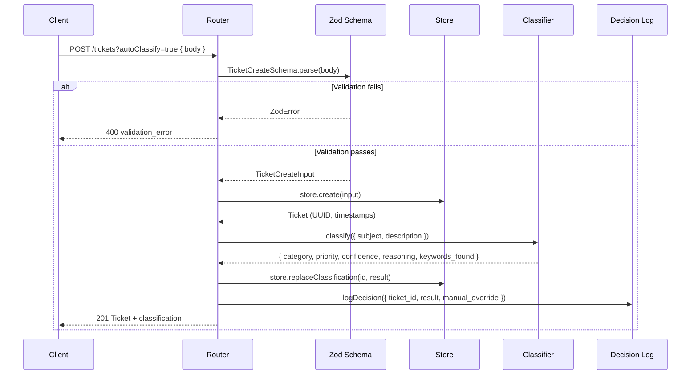
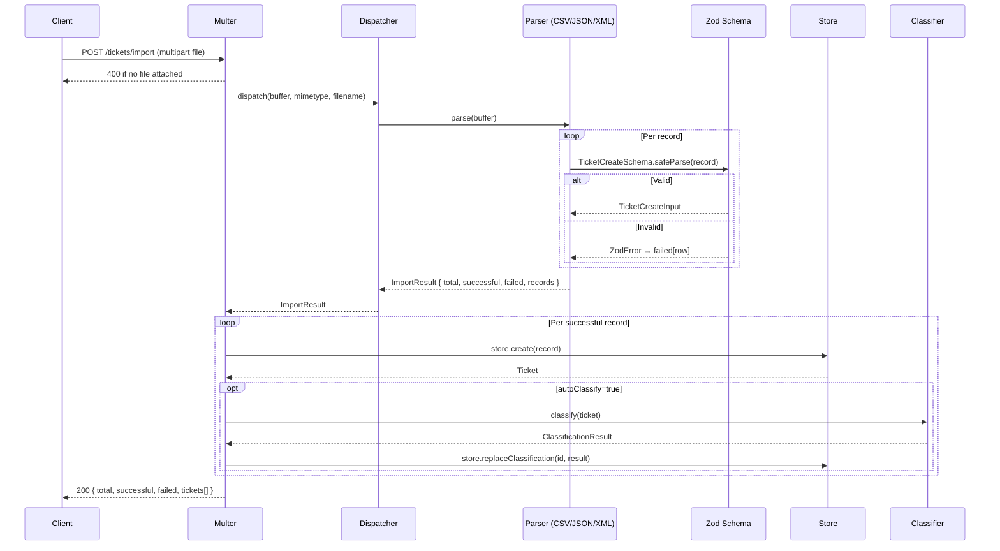
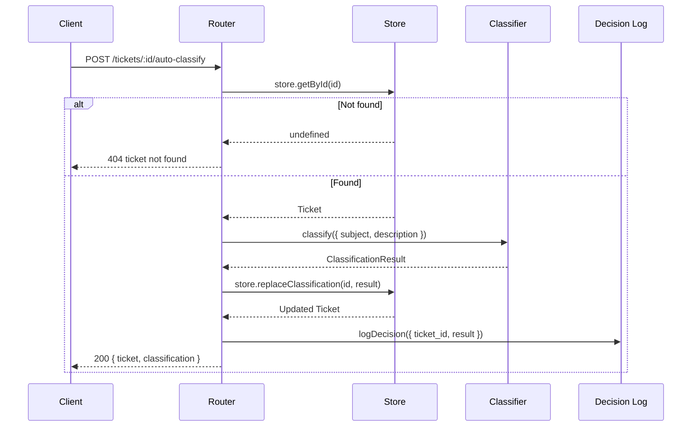

# Architecture

Technical reference for engineering leads and contributors.

---

## High-Level Architecture

---

## Component Descriptions

### `src/app.ts` — Application Factory

Creates and configures the Express app without calling `.listen()`, enabling clean unit testing via `supertest(createApp())`. Mounts body parser, Multer, routes, and centralized error handler in order.

### `src/models/ticket.schema.ts` — Zod Schemas

Single source of truth for all data shapes. TypeScript types are **inferred** from schemas (`z.infer<typeof TicketCreateSchema>`), so models and validators never diverge. Covers ticket creation, partial updates, enums for category/priority/status/source/device, and the nested classification result shape.

### `src/store/ticketStore.ts` — In-Memory Store

Module-level `Map<string, Ticket>` provides O(1) get/put, O(n) list-with-filter. Key functions:

| Function | Description |
|---|---|
| `create(input)` | Assigns UUID + timestamps, stores ticket |
| `getById(id)` | Returns ticket or undefined |
| `update(id, patch)` | Applies partial patch, auto-sets `resolved_at` on `status=resolved` |
| `replaceClassification(id, payload)` | Patches category/priority/classification atomically |
| `list(filters)` | Filters by any combination of category/priority/status/assigned_to/customer_id |
| `clear()` | Test helper — resets store between test suites |

### `src/importers/` — Multi-Format Parsers

All importers share the `ImportResult` interface and follow the same contract: parse the format, validate each record with Zod, return `{ total, successful, failed[], records[] }`. Errors never throw — they are collected per-row so valid rows are always imported.

- **csvImporter**: `csv-parse/sync` with `columns: true`. Splits `tags` column on commas. Reads `metadata.*` from dot-prefixed column names or bare column names.
- **jsonImporter**: Accepts `[...]` or `{ tickets: [...] }`. Per-element Zod validation.
- **xmlImporter**: `fast-xml-parser`. Normalises single-element to array. Collects `<tag>` children into `tags[]`.
- **index.ts dispatcher**: Detects format from MIME type or file extension, throws `HttpError(400)` for unsupported types.

### `src/classifier/` — Rule-Based Classification Engine

Matches subject + description text against ordered keyword tables using word-boundary regex. Fully deterministic with no external dependencies.

- **rules.ts**: Declares `PRIORITY_RULES` (first-match) and `CATEGORY_RULES` (max-match).
- **classifier.ts**: `classify(ticket)` → `ClassificationResult { category, priority, confidence, reasoning, keywords_found }`.
  - Confidence formula: `min(1, 0.4 + 0.15 × |keywords_found|)`
- **log.ts**: Appends every decision to an in-memory array; `manual_override` flag set when caller's explicit category/priority differs from classifier output.

### `src/routes/tickets.ts` — Endpoint Handlers

All handlers wrapped in `asyncHandler()` to forward thrown errors to the centralized error middleware. The `wantsAutoClassify()` helper reads both `?autoClassify=true` query param and `body.autoClassify: true` body flag.

### `src/middleware/errorHandler.ts` — Centralized Error Handling

Four-argument Express error middleware handles:

- `ZodError` → `400 validation_error` with field-level details
- `HttpError` → its `.status` code
- `multer.MulterError` → `400 upload_error`
- Anything else → `500 internal_error`

---

## Data Flow Diagrams

### Create Ticket with Auto-Classification

### Bulk Import Flow

### Auto-Classify Existing Ticket

---

## Design Decisions and Trade-offs

| Decision | Rationale | Alternative | Trade-off |
|---|---|---|---|
| **In-memory store** | Zero setup, fast tests, fits homework scope | PostgreSQL + Prisma | No persistence across restarts; cannot scale horizontally |
| **Zod for validation** | Single source of truth, types inferred, rich error messages | class-validator / manual checks | Adds `zod` dependency, slightly verbose schemas |
| **Rule-based classifier** | Deterministic, testable, no API key, explainable | Claude API / NLP | Cannot learn from new patterns without code changes |
| **Keyword max-match for category** | Most evidence wins; transparent and debuggable | First-match (priority rules style) | Tie-breaking by declaration order can feel arbitrary |
| **First-match for priority** | Urgency keywords should not be diluted by count | Max-match | A ticket with many "low" words could mask one "urgent" |
| **confidence = 0.4 + 0.15n** | Simple, auditable, tests can assert exact values | Logistic regression | Not calibrated to real data; base 0.4 is arbitrary |
| **asyncHandler wrapper** | Avoids try/catch in every route; propagates to error middleware | try/catch per handler | Extra abstraction layer |
| **Module-level Map** | Simple, no DI container needed | Class-based repository | Hard to swap implementation without changing import paths |
| **`clear()` test helper** | Enables isolated test suites | Database transactions / mocking | Exposed test utility in production code |

---

## Security Considerations

### Current State

| Area | Status | Notes |
|---|---|---|
| Authentication | ❌ None | Add JWT / API keys for production |
| Authorization | ❌ None | Any caller can read/modify any ticket |
| Rate limiting | ❌ None | Add `express-rate-limit` |
| Input validation | ✅ Zod | All request bodies and query params validated |
| File upload size | ✅ 5MB limit | `multer.limits.fileSize` |
| SQL injection | ✅ N/A | In-memory store, no SQL |
| XSS | ✅ N/A | JSON API only, no HTML rendering |
| Path traversal | ✅ N/A | No file system reads from user input |
| Enum injection | ✅ Zod enums | Invalid enum values rejected with 400 |

### Production Hardening Checklist

- [ ] Add authentication middleware (JWT or API keys)
- [ ] Add per-IP rate limiting
- [ ] Add HTTPS / TLS termination
- [ ] Sanitize `customer_name` / `subject` if ever rendered in HTML
- [ ] Add request ID header for distributed tracing
- [ ] Replace `console.log` with structured logger (pino / winston)
- [ ] Rotate and expire classification log entries
- [ ] Add CORS configuration for browser clients

---

## Performance Considerations

### Benchmark Results (local machine)

| Operation | n | Time | Complexity |
|---|---|---|---|
| Create tickets | 1000 | < 1500ms | O(1) per create |
| Filter list | 1000 items | < 200ms | O(n) scan |
| Import CSV | 500 rows | < 2000ms | O(n) parse + validate |
| Classify tickets | 1000 | < 1000ms | O(m) per ticket (m = keyword count) |
| Concurrent GETs | 50 | < 1500ms | O(n) per request |

### Bottlenecks at Scale

1. **O(n) filtering** — With >100k tickets, add indexes. Replace Map with a database and indexed columns on `status`, `priority`, `category`, `assigned_to`.
2. **No pagination** — `GET /tickets` returns all matches. Add `?limit=50&offset=0` with cursor-based paging.
3. **Classifier runs synchronously** — For bulk imports of thousands of tickets, move classification to a background job queue (e.g., BullMQ).
4. **In-memory store** — Lost on process restart. Single-process only (no horizontal scaling). Replace with PostgreSQL for production.

---

See [API_REFERENCE.md](../api/API_REFERENCE.md) for endpoint usage.
See [TESTING_GUIDE.md](../testing/TESTING_GUIDE.md) for test strategy.
