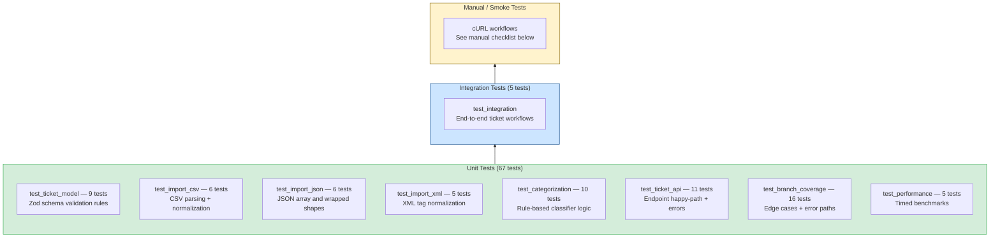

# Testing Guide

Reference for QA engineers and contributors running, extending, or debugging the test suite.

---

## Test Pyramid



**Coverage results (last run)**

| Metric | Result | Threshold |
|---|---|---|
| Statements | 98.92% | 85% ✅ |
| Branches | 93.52% | 85% ✅ |
| Functions | 92.3% | 85% ✅ |
| Lines | 99.38% | 85% ✅ |

---

## How to Run Tests

### Prerequisites

```bash
npm install
```

### Run All Tests

```bash
npm test
```

### Run with Coverage Report

```bash
npm run test:coverage
```

Coverage output is written to `coverage/` (HTML report at `coverage/index.html`).

### Run a Single Test File

```bash
npx jest tests/test_ticket_api.test.ts
npx jest tests/test_categorization.test.ts
```

### Run Tests Matching a Name Pattern

```bash
# Run all tests containing "import"
npx jest --testNamePattern="import"

# Run all tests in files matching "model"
npx jest -t "model"
```

### Watch Mode (re-run on file change)

```bash
npx jest --watch
```

### Verbose Output

```bash
npx jest --verbose
```

---

## Test File Locations

```
tests/
├── helpers.ts                        # makeTicketInput() factory
├── fixtures/                         # Sample data files
│   ├── tickets_valid.csv             # 3 valid tickets (various categories)
│   ├── tickets_valid.json            # 2 valid tickets (array shape)
│   ├── tickets_valid_wrapped.json    # 1 ticket ({ tickets: [...] } shape)
│   ├── tickets_valid.xml             # 2 valid tickets with <tag> children
│   ├── tickets_xml_single.xml        # 1 ticket (single-element normalization)
│   ├── tickets_invalid_row.csv       # 1 bad email + 1 valid (partition test)
│   ├── tickets_invalid_fields.json   # 1 bad email + 1 valid (partition test)
│   ├── tickets_malformed.csv         # Unbalanced quote (parse error test)
│   └── tickets_malformed.xml         # Unclosed tag (parse error test)
│
├── test_ticket_api.test.ts           # 11 API endpoint tests
├── test_ticket_model.test.ts         # 9 Zod schema tests
├── test_import_csv.test.ts           # 6 CSV importer tests
├── test_import_json.test.ts          # 6 JSON importer tests
├── test_import_xml.test.ts           # 5 XML importer tests
├── test_categorization.test.ts       # 10 classifier tests
├── test_integration.test.ts          # 5 integration tests
├── test_performance.test.ts          # 5 performance benchmarks
└── test_branch_coverage.test.ts      # 16 edge-case / branch tests
```

---

## Test Suite Details

### `test_ticket_api.test.ts` — API Endpoints (11 tests)

Tests all 7 endpoints via `supertest`. Each test calls `store.clear()` in `beforeEach` for isolation.

| # | Test | What it verifies |
|---|---|---|
| 1 | POST creates ticket | 201, UUID format, timestamps present |
| 2 | POST missing required field | 400 validation_error |
| 3 | POST invalid email | 400 |
| 4 | POST subject > 200 chars | 400 |
| 5 | GET /tickets empty initially | 200, empty array |
| 6 | GET filter by category | Correct subset returned |
| 7 | GET filter priority + status | Combined filter works |
| 8 | GET /:id found then 404 | Correct status codes |
| 9 | PUT updates fields + updated_at | updated_at advances |
| 10 | PUT status=resolved sets resolved_at | Timestamp auto-set |
| 11 | DELETE 204, GET 404 | Ticket removed |

### `test_ticket_model.test.ts` — Zod Validation (9 tests)

Tests the schema directly without HTTP, for fast feedback.

| # | Test |
|---|---|
| 1 | Accepts fully valid input |
| 2 | Rejects missing customer_email |
| 3 | Rejects invalid email format |
| 4 | Rejects subject < 1 or > 200 chars |
| 5 | Rejects description < 10 or > 2000 chars |
| 6 | Rejects invalid category/priority/status enum values |
| 7 | Rejects non-string tags array elements |
| 8 | Rejects invalid metadata.source enum |
| 9 | TicketUpdateSchema accepts partial input |

### `test_import_csv.test.ts` — CSV Importer (6 tests)

| # | Test |
|---|---|
| 1 | Parses valid file (3 rows, all imported) |
| 2 | Tags column split on commas |
| 3 | `metadata.*` columns mapped to nested object |
| 4 | Invalid email row → failed[], valid rows still imported |
| 5 | Malformed CSV (unbalanced quote) → graceful error |
| 6 | Empty file → total: 0 |

### `test_import_json.test.ts` — JSON Importer (6 tests)

| # | Test |
|---|---|
| 1 | Top-level array |
| 2 | `{ tickets: [...] }` wrapped shape |
| 3 | Mixed valid + invalid records partitioned |
| 4 | Invalid JSON syntax → graceful error |
| 5 | Non-object array element → row-level error |
| 6 | Wrong top-level shape (not array, not wrapped) → error |

### `test_import_xml.test.ts` — XML Importer (5 tests)

| # | Test |
|---|---|
| 1 | Standard `<tickets><ticket>` structure |
| 2 | Single `<ticket>` normalised to array |
| 3 | `<tag>` children collected into tags[] |
| 4 | Malformed XML → graceful error |
| 5 | Missing required field → row failure |

### `test_categorization.test.ts` — Classifier (10 tests)

| # | Test |
|---|---|
| 1 | `can't access` → urgent |
| 2 | `production down` → urgent |
| 3 | `security` → urgent |
| 4 | `blocking` / `asap` → high |
| 5 | `minor` / `cosmetic` → low |
| 6 | No keywords → medium / other, confidence 0.4 |
| 7 | `password reset` → account_access |
| 8 | `refund invoice` → billing_question |
| 9 | `steps to reproduce` → bug_report |
| 10 | Multiple keywords → confidence > 0.7, reasoning includes keywords |

### `test_integration.test.ts` — End-to-End (5 tests)

| # | Test |
|---|---|
| 1 | Full lifecycle: create → list → get → update → delete |
| 2 | CSV bulk import → filters work on imported data |
| 3 | Bulk import + `autoClassify=true` → category/priority set |
| 4 | Manual category survives auto-classify on create |
| 5 | `POST /auto-classify` overwrites category and stores confidence |

### `test_performance.test.ts` — Benchmarks (5 tests)

| # | Test | Budget |
|---|---|---|
| 1 | Create 1000 tickets | < 1500ms |
| 2 | List + filter 1000 tickets | < 200ms |
| 3 | Import 500-row CSV | < 2000ms |
| 4 | Classify 1000 tickets | < 1000ms |
| 5 | 50 concurrent GET requests | < 1500ms |

---

## Manual Testing Checklist

Start the dev server before running these:

```bash
npm run dev
# Server: http://localhost:3000
```

### Health Check

- [ ] `GET /health` → `{ "ok": true }`

### CRUD Lifecycle

- [ ] `POST /tickets` with all required fields → 201, UUID returned
- [ ] `POST /tickets` missing `customer_email` → 400, validation_error
- [ ] `POST /tickets` invalid email format → 400
- [ ] `POST /tickets` subject > 200 chars → 400
- [ ] `GET /tickets` → 200, `count` reflects created tickets
- [ ] `GET /tickets?category=account_access` → filtered results
- [ ] `GET /tickets?priority=urgent&status=new` → combined filter
- [ ] `GET /tickets/:id` valid ID → 200 with ticket
- [ ] `GET /tickets/non-existent-id` → 404
- [ ] `PUT /tickets/:id` `{ "status": "resolved" }` → `resolved_at` populated
- [ ] `PUT /tickets/:id` `{ "assigned_to": "agent-1" }` → field updated
- [ ] `DELETE /tickets/:id` → 204
- [ ] `GET /tickets/:id` after delete → 404

### Auto-Classification

- [ ] `POST /tickets?autoClassify=true` subject "Production down" → `priority: urgent`
- [ ] `POST /tickets?autoClassify=true` subject "Minor cosmetic" → `priority: low`
- [ ] `POST /tickets?autoClassify=true` description includes "refund invoice" → `category: billing_question`
- [ ] `POST /tickets/:id/auto-classify` → 200, `classification.confidence` between 0 and 1
- [ ] Manual category in body + `autoClassify=true` → manual category wins, classification stored

### Bulk Import

- [ ] `POST /tickets/import` CSV file → 200, `total` matches row count
- [ ] `POST /tickets/import` JSON file (array) → imported successfully
- [ ] `POST /tickets/import` XML file → imported successfully
- [ ] `POST /tickets/import` CSV with one invalid row → `successful + failed.length = total`
- [ ] `POST /tickets/import` malformed CSV → graceful error in `failed`
- [ ] `POST /tickets/import` unsupported file type → 400
- [ ] `POST /tickets/import` no file attached → 400
- [ ] `POST /tickets/import?autoClassify=true` CSV → tickets have `classification` field

### Error Handling

- [ ] Send invalid JSON body → 400
- [ ] Send unknown `category` enum value → 400
- [ ] File larger than 5MB → 400 upload_error

---

## Performance Benchmarks Table

| Scenario | n | Expected | Notes |
|---|---|---|---|
| Ticket creation throughput | 1000 | < 1500ms | In-memory Map, O(1) write |
| List with filter | 1000 items | < 200ms | O(n) scan |
| CSV parse + validate | 500 rows | < 2000ms | csv-parse/sync, per-row Zod |
| Classification | 1000 tickets | < 1000ms | Pure regex, no I/O |
| Concurrent GET requests | 50 | < 1500ms | Node.js event loop, no blocking |

All thresholds are CI-safe (generous for slow machines). Run `npm run test:coverage` to execute and verify.

---

## Adding New Tests

### Unit Test Pattern

```typescript
import { createApp } from "../src/app";
import * as store from "../src/store/ticketStore";
import { makeTicketInput } from "./helpers";

const app = createApp();

beforeEach(() => store.clear());

it("my test", async () => {
  const res = await request(app)
    .post("/tickets")
    .send(makeTicketInput({ subject: "Test" }));
  expect(res.status).toBe(201);
});
```

### Classifier Unit Test Pattern

```typescript
import { classify } from "../src/classifier/classifier";

it("classifies feature request", () => {
  const result = classify({
    subject: "Please add dark mode",
    description: "Would love this enhancement to the dashboard."
  });
  expect(result.category).toBe("feature_request");
  expect(result.priority).toBe("low");
});
```

### Adding a Fixture File

1. Create file in `tests/fixtures/` (CSV, JSON, or XML)
2. Import it in the relevant test with:
   ```typescript
   const fix = (n: string) => fs.readFileSync(path.join(__dirname, "fixtures", n));
   ```

---

See [ARCHITECTURE.md](../architecture/ARCHITECTURE.md) for how each component works internally.
See [API_REFERENCE.md](../api/API_REFERENCE.md) for endpoint reference.
