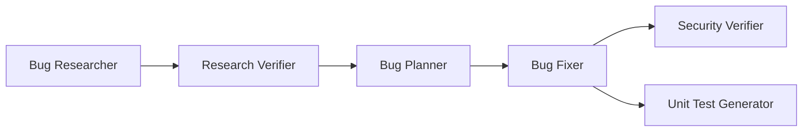

# Homework 4 — 4-Agent Bug-Fix Pipeline + Sample App

**Author:** Valentyn Korniienko

A 4-agent pipeline (research verification → bug fixing → security review → unit-test
generation) plus a small, self-contained **sample application** for the pipeline to operate
on. The app ships in a deliberately broken "before" state — two functional bugs and one
security issue — so the pipeline produces concrete, demonstrable before/after results.

---

## The pipeline



### Agents (`.claude/agents/`)

| Agent | Model | Why this model |
|-------|-------|----------------|
| `research-verifier` | **opus** | Forensic fact-checking of file:line references and snippets needs careful, high-accuracy reasoning. |
| `bug-fixer` | **sonnet** | Faithfully applying a pre-written plan is structured execution — fast and cost-effective. |
| `security-verifier` | **opus** | Vulnerability analysis and data-flow reasoning benefit from the strongest model. |
| `unit-test-generator` | **sonnet** | Test scaffolding follows the FIRST skill and existing conventions — routine, pattern-driven work. |

### Skills (`.claude/skills/`)

- `research-quality-measurement` — quality levels/rubric the Research Verifier uses when
  writing `verified-research.md`.
- `unit-tests-FIRST` — the FIRST principles (Fast, Independent, Repeatable, Self-validating,
  Timely) the Unit Test Generator must satisfy.

---

## The sample application — `ledger` CLI

A tiny, **zero-dependency** Node.js CLI for quick math on amounts. Pure functions in
`src/` with a thin CLI dispatcher; tests use the built-in `node:test` runner.

```
homework-4/
├── src/
│   ├── calc.js       # sum, average (BUG-001), applyDiscount (BUG-002)
│   ├── evaluate.js   # evaluateExpression -> eval() (SEC-001)
│   └── index.js      # CLI dispatcher
├── tests/
│   ├── calc.test.js
│   └── evaluate.test.js
├── context/bugs/001/bug-context.md
├── run-pipeline.sh  # single-command runner for the 6-stage pipeline
├── package.json
├── README.md
└── HOWTORUN.md
```

### Run it

No install needed (zero dependencies). Requires **Node 18+**.

```bash
npm start sum 1 2 3        # 6
npm start avg 2 4 6        # 4
npm start discount 200 10  # 190  (buggy — should be 180; see BUG-002)
npm start calc "2 + 3"     # 5
npm test                   # runs the test suite
```

### Seeded issues (the "before" state)

| ID | File | Type | Summary |
|----|------|------|---------|
| BUG-001 | `src/calc.js` | Logic | `average([])` returns `NaN` (no empty-array guard). |
| BUG-002 | `src/calc.js` | Logic | `applyDiscount` subtracts the percent as a flat amount (`200,10` → `190`, should be `180`). |
| SEC-001 | `src/evaluate.js` | Security (CWE-95) | `evaluateExpression` passes untrusted input to `eval()` → arbitrary code execution. |

Full details and reproduction steps: [`context/bugs/001/bug-context.md`](context/bugs/001/bug-context.md).

> ⚠️ **The test suite is intentionally red until the pipeline runs.** The starter tests in
> `tests/` assert the *correct* behavior, so before any fix `npm test` reports **2 failing,
> 2 passing** — that is the documented before-state. After the Bug Fixer applies the fixes,
> the suite goes green, and the Unit Test Generator adds further FIRST-compliant tests.

---

## Running the pipeline — `run-pipeline.sh`

The entire pipeline runs **headless, in order, with a single command** via
[`run-pipeline.sh`](run-pipeline.sh):

```bash
npm run pipeline            # equivalent to ./run-pipeline.sh
./run-pipeline.sh           # run the full pipeline
./run-pipeline.sh --reset   # restore src/ & tests/ to the "before" state first
```

**Requirements:** the [`claude` CLI](https://docs.claude.com/en/docs/claude-code) on your
`PATH` and **Node.js 18+**. The script checks both up front and exits early if either is
missing.

### What the script does

Each stage is a separate Claude Code session. The four dedicated agents run via
`--agent <name>` (so they load the model + tools + skills from their
`.claude/agents/*.md` frontmatter); the two feeder stages run as plain prompted sessions.
All sessions run with `--print --permission-mode bypassPermissions` so the pipeline can
edit files and run tests unattended — **run it only in a trusted local checkout.**

| # | Stage | How it runs | Output |
|---|-------|-------------|--------|
| 1 | Bug Researcher | inline prompted session | `research/codebase-research.md` |
| 2 | Research Verifier | `--agent research-verifier` (opus) | `research/verified-research.md` |
| 3 | Bug Planner | inline prompted session | `implementation-plan.md` |
| 4 | Bug Fixer | `--agent bug-fixer` (sonnet) | edits `src/` + `fix-summary.md` |
| 5 | Security Verifier | `--agent security-verifier` (opus) | `security-report.md` |
| 6 | Unit Test Generator | `--agent unit-test-generator` (sonnet) | `tests/` + `test-report.md` |

All artifacts are written under `context/bugs/001/` and reference the real files in `src/`
and `tests/`. The script prints a per-stage banner with timing, a final checklist of the
expected artifacts, and a closing `npm test` run.

The `--reset` flag runs `git checkout -- src/ tests/` first, restoring the seeded "before"
state so the run is fully reproducible.

## How the pipeline uses this app

When run, the pipeline produces these artifacts (referencing the real files above):
`research/verified-research.md`, `implementation-plan.md`, `fix-summary.md`,
`security-report.md`, `test-report.md`. The Security Verifier is expected to flag SEC-001;
the Bug Fixer resolves BUG-001/BUG-002; the Unit Test Generator backfills regression tests.

See [`HOWTORUN.md`](HOWTORUN.md) for step-by-step instructions.
