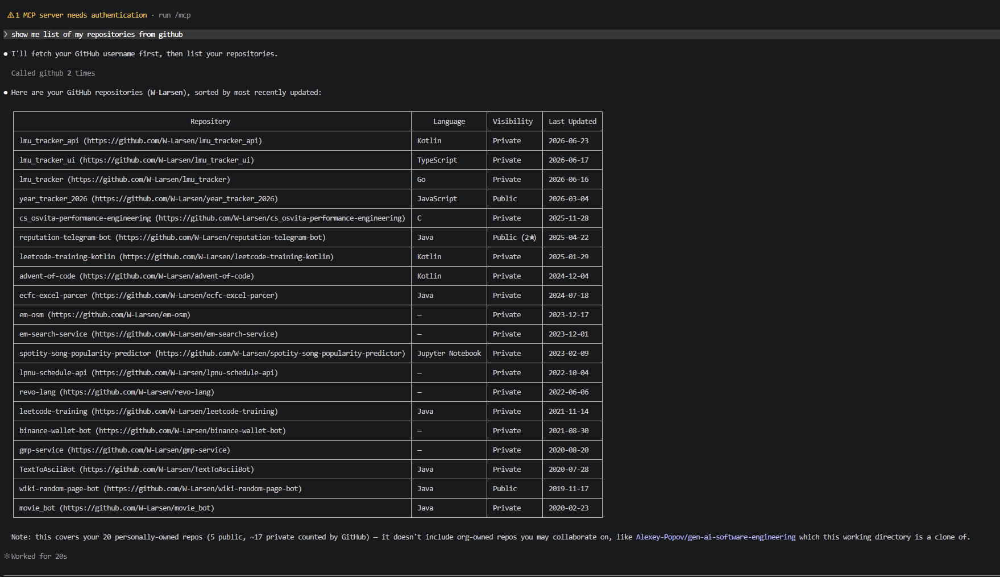
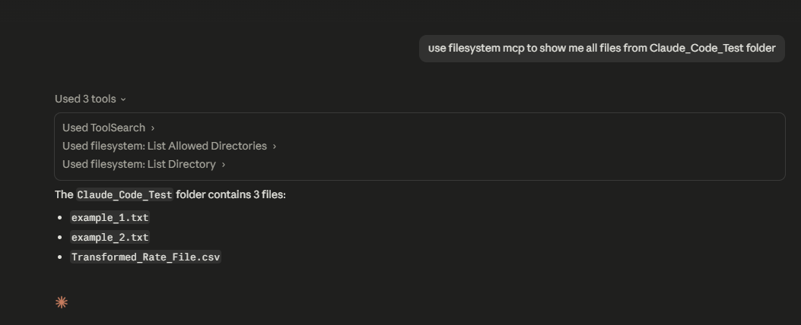
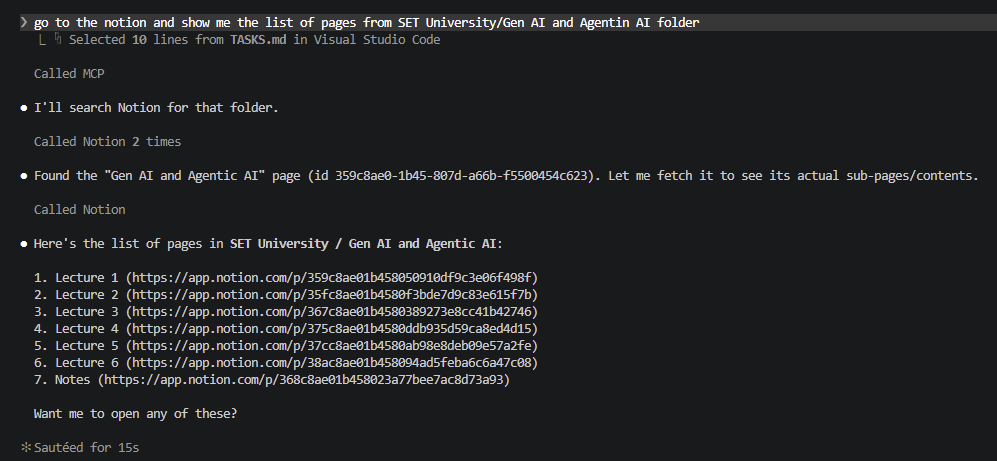
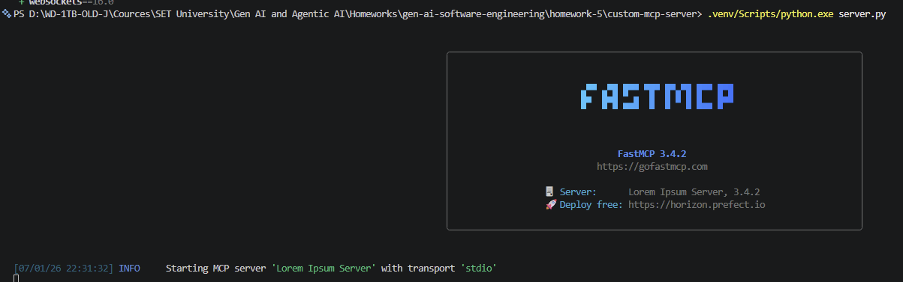
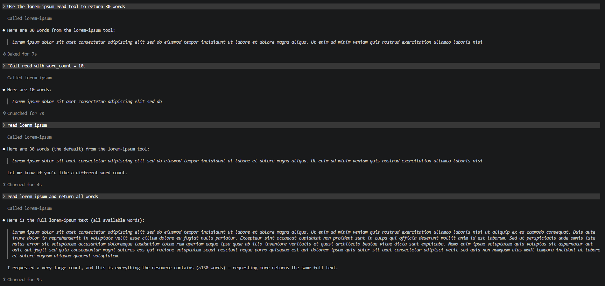

# Homework 5 — Configure MCP Servers (GitHub, Filesystem, Notion/Jira, Custom)

**Author:** Valentyn Korniienko

This homework installs and configures three external MCP servers (GitHub,
Filesystem, Notion) and builds one **custom MCP server** with **FastMCP**. Each
server was registered with the client, verified running, and exercised with at
least one real interaction (screenshots below). The custom server is registered
in [`.mcp.json`](.mcp.json); the external servers are configured in the client's
global MCP settings.

---

## Task 1 — GitHub MCP ⭐

Connected Claude to GitHub via the official GitHub MCP server.

- **Interaction:** *"show me list of my repositories from github"*
- **Result:** the server authenticated, resolved the GitHub username, and
  returned all repositories sorted by most-recently-updated — with language,
  visibility, and last-updated date for each.



---

## Task 2 — Filesystem MCP ⭐

Connected Claude to a local directory via the Filesystem MCP server.

- **Interaction:** *"use filesystem mcp to show me all files from Claude_Code_Test folder"*
- **Result:** the server listed the allowed directories and enumerated the
  folder contents (`example_1.txt`, `example_2.txt`, `Transformed_Rate_File.csv`).



---

## Task 3 — Notion MCP ⭐⭐

Connected Claude to Notion via the Notion MCP server so it can query a real
workspace.

- **Interaction:** *"go to the notion and show me the list of pages from
  SET University/Gen AI and Agentic AI folder"*
- **Result:** the server searched Notion, located the parent page, and returned
  its sub-pages (Lecture 1–6 and Notes) as page links/IDs — matching the request
  pattern for retrieving pages of a project.



---

## Task 4 — Custom MCP Server with FastMCP ⭐⭐⭐

A minimal MCP server that serves word-limited text from a local Markdown file.

### What it does

- **Source file:** [`custom-mcp-server/lorem-ipsum.md`](custom-mcp-server/lorem-ipsum.md)
- **Resource** `lorem://ipsum` — returns the default **30** words from the file.
  - **Resource template** `lorem://ipsum/{word_count}` — returns exactly
    `word_count` words (e.g. `lorem://ipsum/50`).
- **Tool** `read(word_count: int = 30)` — an action Claude can call that returns
  exactly `word_count` words from the same file.

### Resources vs. Tools

- **Resources** are **URIs that Claude can read from** (e.g. files, APIs). Here,
  `lorem://ipsum` reads the contents of `lorem-ipsum.md`. Reading a resource is a
  passive "give me this content" operation.
- **Tools** are **actions Claude can call to perform operations** (e.g. reading a
  file, running a command). Here, the `read` tool actively fetches and returns
  `word_count` words. Tools can take parameters and are invoked as function calls.

### Files

| File | Purpose |
|------|---------|
| [`custom-mcp-server/server.py`](custom-mcp-server/server.py) | FastMCP server: resource + `read` tool |
| [`custom-mcp-server/lorem-ipsum.md`](custom-mcp-server/lorem-ipsum.md) | Source text the resource/tool read from |
| [`custom-mcp-server/requirements.txt`](custom-mcp-server/requirements.txt) | Dependencies — includes `fastmcp` |
| [`custom-mcp-server/pyproject.toml`](custom-mcp-server/pyproject.toml) | Project metadata + `fastmcp` dependency, pins Python `>=3.12,<3.14` |
| [`.mcp.json`](.mcp.json) | MCP client config; custom server registered as `lorem-ipsum` |
| [`HOWTORUN.md`](HOWTORUN.md) | Install, run, connect, and usage instructions |

### Quick start

```bash
cd custom-mcp-server
uv venv --python 3.12 .venv
uv pip install --python .venv -r requirements.txt
.venv/Scripts/python.exe server.py    # starts the stdio MCP server
```

See **[HOWTORUN.md](HOWTORUN.md)** for full instructions, the MCP configuration,
and how to test the `read` tool.

> **Note:** FastMCP's `pydantic` dependency does not yet support the Python 3.14
> release candidate, so the server runs on a pinned Python 3.12 environment.

### Results

The server starts as a stdio MCP server ("Lorem Ipsum Server" on FastMCP 3.4.2):



Claude calls the `read` tool with different word counts — default `30`, an
explicit `word_count = 10`, and a very large count that returns the full text:



---

## Deliverables

| Deliverable | Location |
|-------------|----------|
| MCP configuration (4 servers) | [`.mcp.json`](.mcp.json) |
| Custom MCP server | [`custom-mcp-server/server.py`](custom-mcp-server/server.py) |
| Dependencies (incl. `fastmcp`) | [`requirements.txt`](custom-mcp-server/requirements.txt), [`pyproject.toml`](custom-mcp-server/pyproject.toml) |
| Lorem ipsum source | [`custom-mcp-server/lorem-ipsum.md`](custom-mcp-server/lorem-ipsum.md) |
| Screenshots | [`docs/screenshots/`](docs/screenshots/) |
| Documentation | This README + [`HOWTORUN.md`](HOWTORUN.md) |
