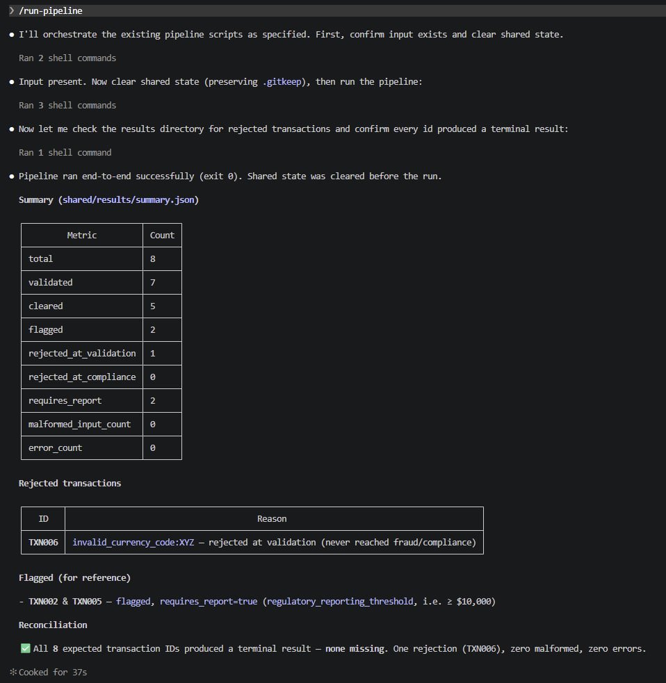
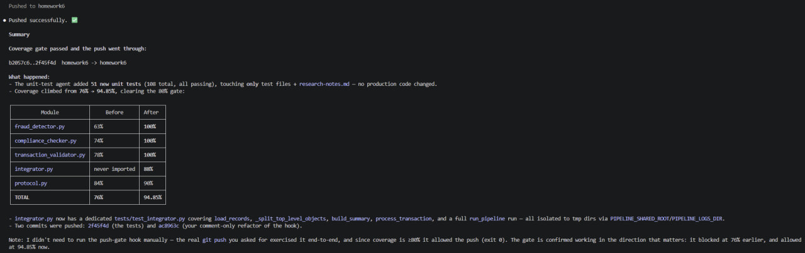
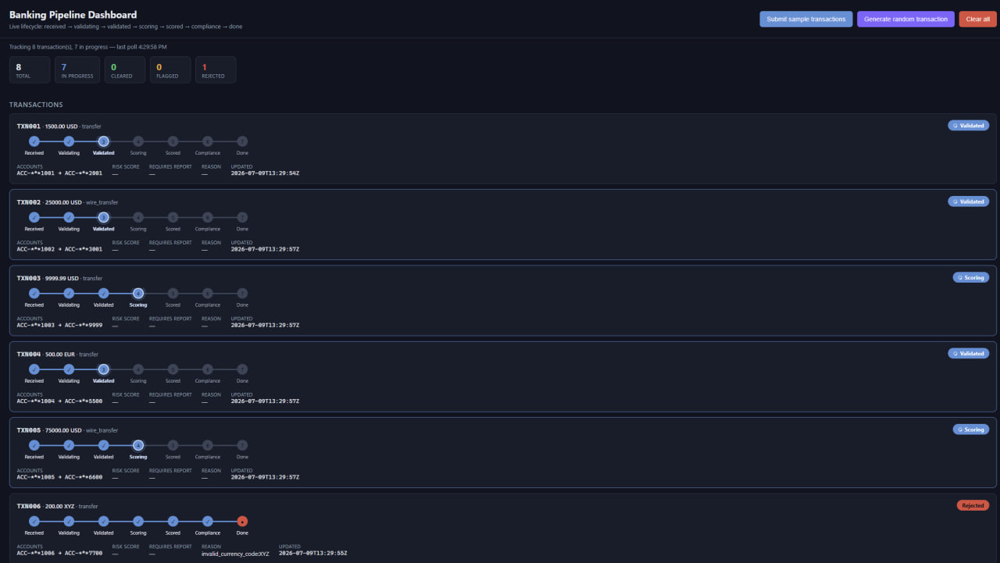
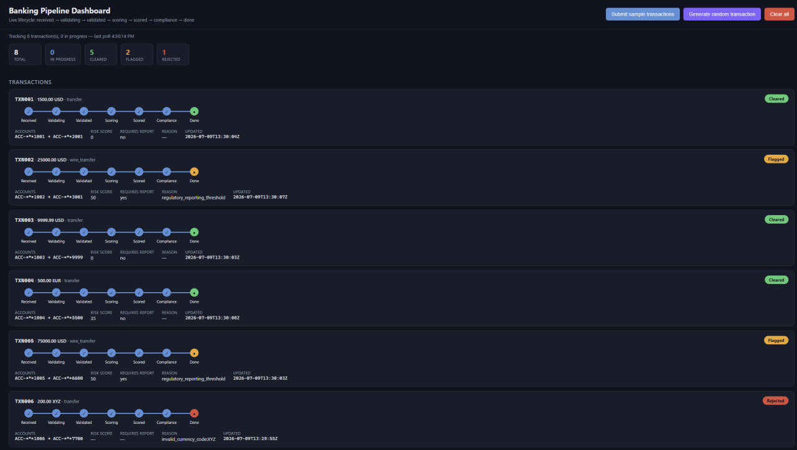
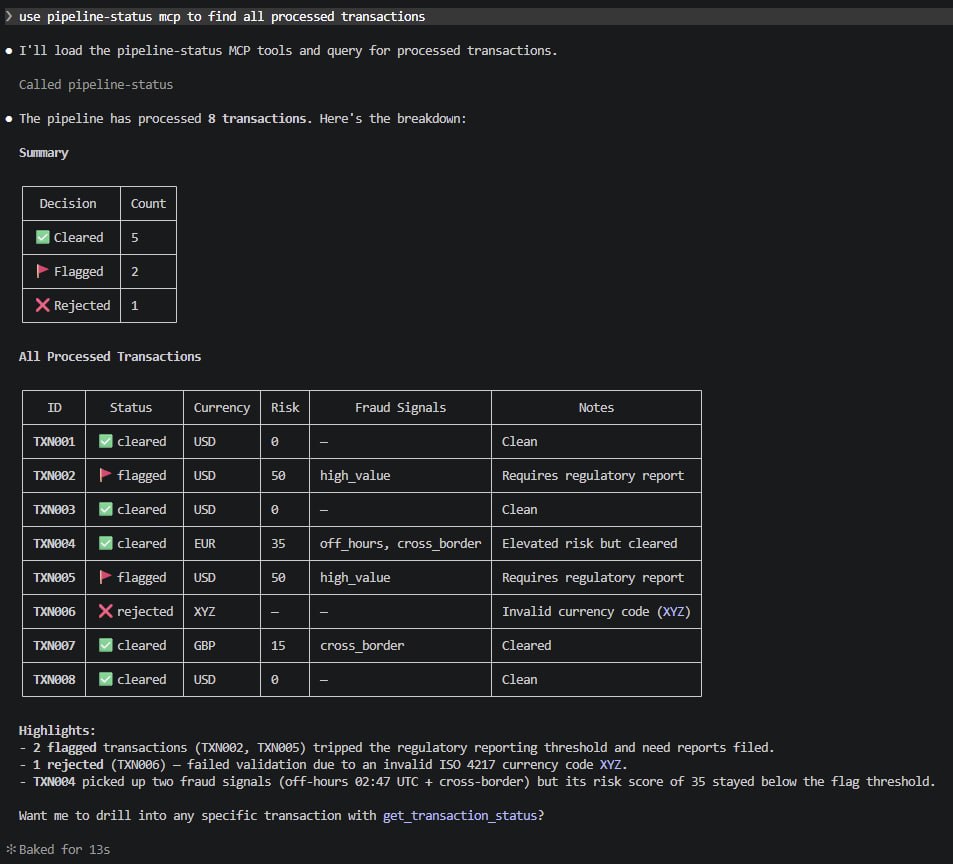
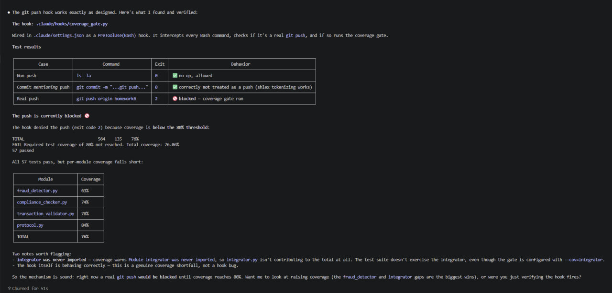

# Banking Transaction-Processing Pipeline

**Created by Valentyn Korniienko**

Homework 6 capstone — SET University, Gen AI and Agentic AI. This repository is the output of four
Claude Code meta-agents (specification, code generation, unit tests, documentation) building a
file-based, multi-agent banking transaction-processing pipeline from scratch, per
[`TASKS.md`](TASKS.md) and [`specification.md`](specification.md).

To see the whole system run end-to-end in one command — dependencies, pipeline, tests, MCP tools,
and the live dashboard — run `bash demo.sh` from this directory (macOS/Linux/Git Bash). It needs
only Python 3.11+ and `curl`; see [`HOWTORUN.md`](HOWTORUN.md) for the flags and for the manual
equivalent of each step.

**Windows PowerShell**: plain `bash` on `PATH` may resolve to the WSL launcher stub
(`C:\Windows\System32\bash.exe`) instead of Git Bash, which fails if no WSL distro is installed.
Invoke Git Bash explicitly with `--login` so its profile puts `dirname`/`sed`/coreutils on `PATH`:

```powershell
& "C:\Program Files\Git\usr\bin\bash.exe" --login demo.sh
```

## What the system does

The pipeline ingests raw banking transaction records from [`sample-transactions.json`](sample-transactions.json)
(8 sample rows, `TXN001`–`TXN008`, covering edge cases such as an invalid ISO 4217 currency code,
a negative-amount refund, an off-hours timestamp, high-value wires, and a boundary amount just
under the $10,000 reporting threshold) and drives every transaction through three cooperating
agents — **Transaction Validator → Fraud Detector → Compliance Checker** — communicating
exclusively via JSON message files under `shared/{input,processing,output,results}/`. Every
transaction ends in exactly one terminal outcome file in `shared/results/` carrying its validation
status, fraud `risk_score`/`fraud_review` flag, and final compliance `decision`
(`cleared` / `flagged` / `rejected`), plus a `shared/results/summary.json` aggregate report.

Monetary amounts are parsed and compared only as `decimal.Decimal` (never `float`), currency codes
are checked against a static ISO 4217 table, every agent operation is written to an append-only,
ISO 8601-timestamped audit log (`logs/audit.log`) with account numbers masked to their last 4
digits, and every agent is idempotent — re-processing an already-resulted `transaction_id` returns
the stored outcome instead of recomputing it. A read-only FastAPI dashboard and a custom FastMCP
server sit on top of the same `shared/results/` data to observe and query the pipeline without
duplicating any of its decision logic.

## Agent responsibilities

- **Transaction Validator** (`agents/transaction_validator.py`, `process_message(message: dict) -> dict`)
  — checks the six required fields, parses `amount` as `decimal.Decimal`, validates the currency
  against the ISO 4217 table, and applies the negative-amount/refund rule (negative amounts are
  only accepted when `transaction_type == "refund"`, stored as the absolute value with
  `direction = "refund_credit"`). Failures are written straight to `shared/results/` with a
  `reason`, bypassing fraud/compliance entirely. Supports `--dry-run` for a validate-only report.
- **Fraud Detector** (`agents/fraud_detector.py`, `process_message(message: dict) -> dict`) — scores
  every validated transaction `0–100` from three signals loaded from
  `agents/config/fraud_rules.json`: `+50` high-value (amount ≥ $10,000 in its stated currency),
  `+20` off-hours (UTC hour in `[0, 6)`), `+15` cross-border (`metadata.country` outside the home
  country set, default `{"US"}`). `fraud_review = true` only when the score is `≥ 50`; fraud is a
  signal, not a hard reject at this stage, so every transaction reaches the compliance stage
  regardless of score.
- **Compliance Checker** (`agents/compliance_checker.py`, `process_message(message: dict) -> dict`)
  — the required third cooperating agent and the pipeline's final decision stage. Flags
  `requires_report = true` at the $10,000 reporting threshold, rejects transactions touching a
  blocked account (`agents/config/blocked_accounts.json`, a synthetic list that never overlaps the
  sample data) or missing a regulated field (`metadata.channel`/`description`) on a cross-border or
  wire transfer, and computes the final decision — `rejected` > `flagged` (fraud_review or
  requires_report) > `cleared` — fail-closed to `flagged` on any internal screening error. Writes
  the terminal message to `shared/results/`.
- **Integrator / Orchestrator** (`integrator.py`, `run_pipeline(sample_file: str = "sample-transactions.json") -> dict`)
  — creates the `shared/` tree, loads and wraps every record from `sample-transactions.json` in the
  standard message envelope, writes them to `shared/input/`, drives each transaction through
  validator → fraud detector → compliance checker in that fixed order, tolerates malformed records
  (writes a synthetic `malformed_input` rejection and continues the batch instead of aborting),
  polls `shared/results/` until every transaction reaches a terminal state (or a 30s timeout), and
  writes/prints `shared/results/summary.json`.
- **Frontend / Web UI** (`frontend/server.py`, FastAPI + `frontend/static/index.html`) — a
  read-only observer plus injector: `POST /submit` (and `POST /random`) drop transactions into the
  pipeline and drive them through the *real* agent `process_message` functions with a simulated
  1–5s pause between stages so the dashboard can animate the lifecycle; `GET /api/status` reads
  `shared/{input,processing,output,results}/` (never re-running agent logic) and returns one masked
  status entry per transaction; `POST /clear` resets the demo. Every response is scrubbed through
  `agents.protocol.mask_pii` — no unmasked account number ever leaves the process.
- **Custom FastMCP server** (`mcp/server.py`) — a thin, read-only query layer over
  `shared/results/`: tool `get_transaction_status(transaction_id: str)` returns one transaction's
  current status, tool `list_pipeline_results()` returns a summary of every processed transaction,
  and resource `pipeline://summary` returns the latest `shared/results/summary.json` (or a computed
  fallback) as text. Only PII-safe fields are ever surfaced.
- **Shared protocol helper** (`agents/protocol.py`) — not a pipeline agent itself, but the single
  piece of glue every agent above depends on: the standard message envelope
  (`message_id`, `timestamp`, `source_agent`, `target_agent`, `message_type`, `data`), atomic
  write-then-`os.replace` file I/O, `Decimal`/ISO 4217 parsing and quantization
  (`ROUND_HALF_EVEN`), idempotency checks, and PII-masked ISO 8601 audit logging.
- **Claude Code meta-agents** (`.claude/agents/`) — the four-agent build process behind this
  repository: `specification-writer` (spec + `/write-spec` skill), `code-generator` with nested
  `transaction-validator` / `fraud-detector` / `compliance-agent` / `frontend-agent` subagents
  (Agent 2, code generation), `unit-test-agent` (Agent 3, tests + the coverage-gate hook), and this
  `documentation-agent` (Agent 4, this README/HOWTORUN).

## Architecture

```
sample-transactions.json
        │
        ▼
  integrator.py  ──creates/clears──▶  shared/{input,processing,output,results}/
        │
        ▼
   shared/input/   (standard message envelope, one JSON file per transaction_id)
        │
        ▼
┌───────────────────────┐   invalid ──▶ shared/results/ (status=rejected, reason=...)
│ Transaction Validator  │──────────────────────────────────────────────────────────┐
└───────────────────────┘                                                            │
        │ valid (status=validated)                                                   │
        ▼                                                                            │
   shared/output/                                                                    │
        │                                                                            │
        ▼                                                                            │
┌───────────────────────┐                                                            │
│    Fraud Detector      │──risk_score, fraud_review, fraud_signals────▶ shared/output/
└───────────────────────┘                                                            │
        │ status=scored                                                              │
        ▼                                                                            │
┌───────────────────────┐                                                            │
│  Compliance Checker    │──decision: cleared / flagged / rejected────────────────────┤
└───────────────────────┘                                                            │
        │                                                                            │
        ▼                                                                            ▼
                        shared/results/<transaction_id>.json  +  shared/results/summary.json
                                              │
                        ┌─────────────────────┴─────────────────────┐
                        ▼                                             ▼
        frontend/server.py (FastAPI, read-only observer +   mcp/server.py (FastMCP: tools
        injector; GET /api/status, POST /submit)             get_transaction_status,
                                                               list_pipeline_results,
                                                               resource pipeline://summary)

Cross-cutting: agents/protocol.py (message envelope, atomic I/O, Decimal/ISO 4217, audit logging)
                logs/audit.log (append-only, ISO 8601, PII-masked)
```

## Tech stack

| Component | Technology | Role |
|---|---|---|
| Language / runtime | Python 3.14 (spec targets 3.11+), type-hinted | Implements all agents, integrator, frontend, and MCP server |
| Money handling | `decimal.Decimal` (stdlib), `ROUND_HALF_EVEN` quantization | Exact monetary arithmetic — amounts are never parsed/compared as `float` |
| Currency validation | Static ISO 4217 table (`agents/protocol.py: CURRENCY_MINOR_UNITS`) | No external FX/currency service dependency in v1 |
| Inter-agent messaging | File-based JSON protocol (`shared/{input,processing,output,results}/`) | Standard message envelope; atomic writes (`tempfile` + `os.replace`) |
| Configuration | `agents/config/fraud_rules.json`, `agents/config/blocked_accounts.json` | Fraud score weights, thresholds, and blocked-account list, versioned outside code |
| Testing | `pytest` 9.1.1 + `pytest-cov` 7.1.0 | Unit tests per agent + one integration test (`tests/test_integrator.py`); coverage gate |
| Web dashboard | `FastAPI` 0.139.0 + `uvicorn` 0.49.0 (`frontend/server.py`, `frontend/static/index.html`) | Read-only lifecycle dashboard + transaction injector, vanilla JS/fetch polling |
| MCP tooling | `mcp` (FastMCP) 1.28.1 (`mcp/server.py`) | Custom `pipeline-status` MCP server: `get_transaction_status`, `list_pipeline_results`, `pipeline://summary` |
| MCP tooling | `context7` MCP (`@upstash/context7-mcp` via `npx`) | Library/framework documentation lookup during code generation (see `research-notes.md`) |
| Automation | Claude Code skills (`.claude/skills/run-pipeline`, `.claude/skills/validate-transactions`, `.claude/skills/write-spec`) | `/run-pipeline`, `/validate-transactions`, `/write-spec` slash commands |
| Automation | Claude Code hooks (`.claude/hooks/coverage_gate.py`, `.claude/hooks/audit_log.py`, `.claude/settings.json`) | `PreToolUse` coverage gate blocks `git push` below 80% coverage; `PostToolUse` audit-log hook |
| Audit trail | `logs/audit.log` (append-only JSON lines) | ISO 8601 timestamp, agent name, transaction id, outcome; PII-masked via `mask_pii`/`mask_account` |

## Screenshots

Demo evidence is captured under [`docs/screenshoots/`](docs/screenshoots/). See
[`HOWTORUN.md`](HOWTORUN.md) for the exact steps to reproduce each capture.

### Pipeline run (`python integrator.py`)



### Test coverage report



### Web UI — processing



### Web UI — finished



### MCP tool interaction



### Coverage-gate `git push` hook firing



## Further reading

- [`specification.md`](specification.md) — full High-/Mid-Level Objectives, Implementation Notes,
  edge-case table, and Low-Level Tasks per agent.
- [`TASKS.md`](TASKS.md) — the assignment brief and deliverables checklist.
- [`research-notes.md`](research-notes.md) — context7/web-search queries made during code
  generation, with the insight applied to each agent.
- [`HOWTORUN.md`](HOWTORUN.md) — step-by-step instructions to run the pipeline, tests, MCP server,
  frontend, and skills end to end.
